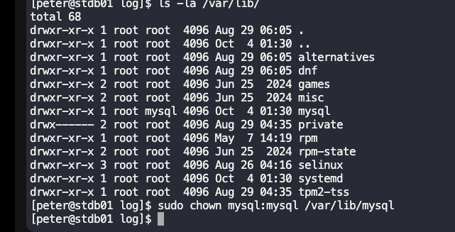

# Day 009: MariaDB Troubleshooting
There is a critical issue going on with the Nautilus application in Stratos DC. The production support team identified that the application is unable to connect to the database. After digging into the issue, the team found that mariadb service is down on the database server.


Look into the issue and fix the same.
```
Error:
2025-10-04  1:33:39 0 [Note] Starting MariaDB 10.5.27-MariaDB source revision 6aa47fae304bd1f3efc0ebd2035bc1481ded73a3 server_uid IK/mVBJLGRL/HpCzP44OZedLeZo= as process 2336
2025-10-04  1:33:39 0 [Note] InnoDB: Uses event mutexes
2025-10-04  1:33:39 0 [Note] InnoDB: Compressed tables use zlib 1.2.11
2025-10-04  1:33:39 0 [Note] InnoDB: Number of pools: 1
2025-10-04  1:33:39 0 [Note] InnoDB: Using crc32 + pclmulqdq instructions
2025-10-04  1:33:39 0 [Note] mariadbd: O_TMPFILE is not supported on /var/tmp (disabling future attempts)
2025-10-04  1:33:39 0 [Note] InnoDB: Using Linux native AIO
2025-10-04  1:33:39 0 [Note] InnoDB: Initializing buffer pool, total size = 134217728, chunk size = 134217728
```

